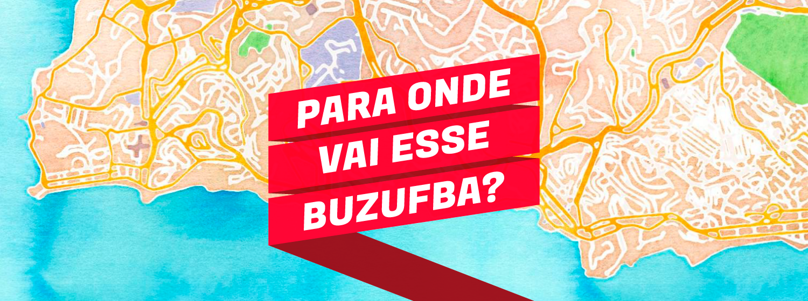
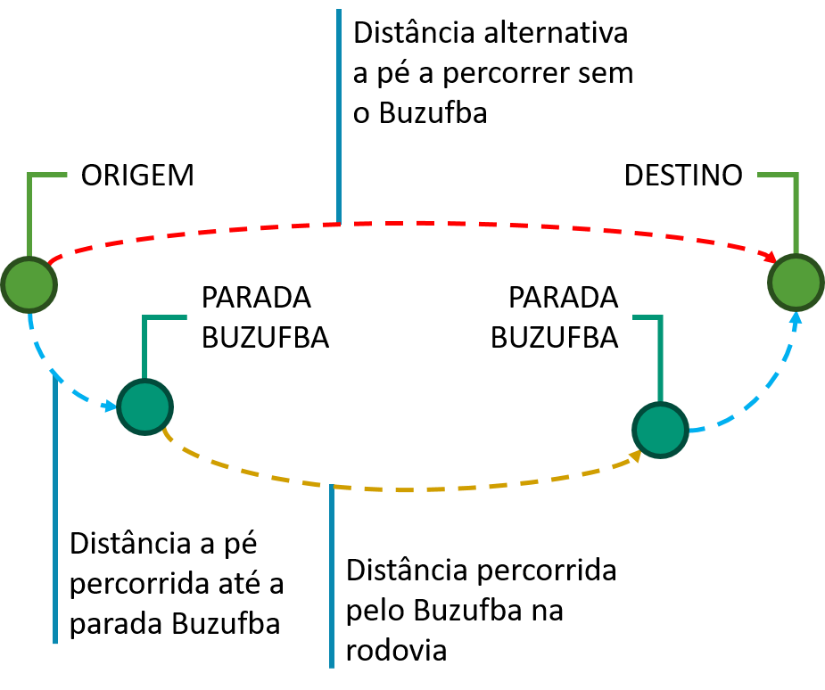
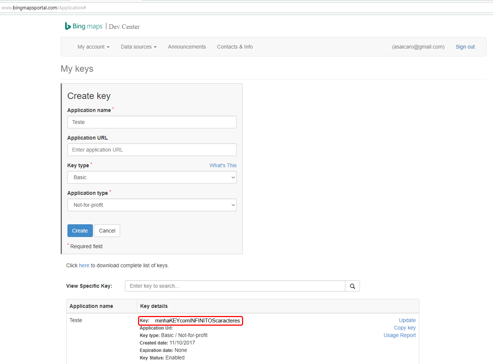
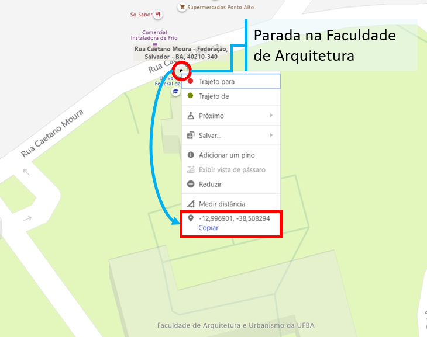

<style>
  .main-container {
    max-width: 1300px;
    margin-left: auto;
    margin-right: auto;
    font-family: "Lucida Sans Unicode", "Lucida Grande", sans-serif;
    font-size: 1.5em;
    text-align: justify;
  }
</style>

```{r message = FALSE, warning = FALSE, echo = FALSE}
if (!require("kableExtra")) devtools::install_github("haozhu233/kableExtra") ; library(kableExtra)
if (!require("knitr")) install.packages("knitr") ; library(knitr)
options(knitr.table.format = "html", width = 150)
load("bus.Rdata")
```


<div style="margin: auto; text-align: center; font-size: 0.625em; padding-bottom: 30px">Fonte: Fábio Senna</div>

# Expondo o problema

Recentemente me deparei com um problema curioso. Eu e meus colegas recebemos dados de cerca de 1600 usuários de um serviço de transporte intercampi gratuito da UFBA (conhecido por Buzufba). No banco havia informações socioeconômicas dos usuários, bem como dados sobre o uso, expectativas e satisfação deles com o serviço. Nós queriamos entender quais variáveis eram mais influentes na impressão geral que os passageiros tinham do serviço, então naturalmente nos voltamos para os dados de expectativa e satisfação (divididos em nove dimensões de qualidade). Entretanto ficamos curiosos e nos perguntamos: **será que o comprimento da viagem afeta a satisfação do usuário?**

<div style="display: inline-block; width: 100%; padding-top: 30px; padding-bottom: 30px">
  <div style="float: left; width: 30%">
  
  <div style="margin: auto; text-align: center; font-size: 0.625em">Fonte: Shutterstock</div>
  </div>

  <div style="float: right; width: 65%">

Infelizmente, essa variável não estava presente no banco. As únicas informações disponíveis eram os locais de origem e destino dos usuários. Também encontramos em uma fonte oficial da universidade a lista de pontos de parada do Buzufba. Assim, estruturamos o roteiro típico de uma jornada de usuário do Buzufba como exibido na Figura 01.

  </div>
</div>


<div style="margin: auto; text-align: center">**Fig. 01:** Esquema hipotético dos deslocamentos dos usuários</div>
<div style="margin: auto; text-align: center; padding-bottom: 30px; font-size: 0.625em">Fonte: Autor</div>


A viagem se dá entre os locais listados no formulário (origem e destino). Os passageiros partem da origem declarada e se dirigem a pé ao ponto do Buzufba mais próximo. Eles adentram o micro-ônibus cuja rota seja a mais direta para seu destino (trajeto mais curto em rodovia). Os passageiros permanecem no micro-ônibus até a parada mais próxima do destino desejado e se deslocam a pé até o local declarado. Nota-se também que alternativamente os usuários podem ignorar o transporte e deslocar-se somente a pé.

<div style="display: inline-block; width: 100%; padding-top: 30px; padding-bottom: 30px">
  <div style="float: left; width: 30%">
  
  <div style="margin: auto; text-align: center; font-size: 0.625em">Fonte: Falando de Flamengo</div>
  </div>

  <div style="float: right; width: 65%">

Dada a lista com os nomes destes locais, precisávamos localizar eles num sistema de coordenadas. Entretanto, para evitar a fadiga, tentamos automatizar o máximo de tarefas possível. Daí entram em ação os **APIs de mapas**. Esta e as próximas etapas a seguir demonstram como conseguimos estimar estas distâncias.

  </div>
</div>

# Key do Bing e conexão com o R (taRifx.geo)

Os APIs de mapas como os ofertados pelo Google, Microsoft e seus rivais têm como vantagem permitir o uso dos famosos serviços geográficos dessas companhias, porém automatizado e em maior volume. Como o Google Maps possui limitações de uso mais severas, utilizamos o Bing Maps. Para tal é preciso de uma **conta Microsoft** e ativação de uma **key básica** no site do **Bing Maps API** (https://www.bingmapsportal.com/Application) como visto na Figura 02.


<div style="margin: auto; text-align: center">**Fig. 02:** Página pessoal para gestão das keys do API</div>
<div style="margin: auto; text-align: center; padding-bottom: 30px; font-size: 0.625em">Fonte: Bing Maps</div>

O limite de uso de cada chave depende de seu propósito. Para usos estudantis ou não-lucrativos são permitidas **50.000** pesquisas a cada período de 24 horas. Para fazer as buscas a partir do R é preciso apenas do código da key (destacado em vermelho na Figura 02). Isso é feito com o auxílio de dois pacotes: **taRifx.geo** e **remotes**.

<div style="display: inline-block; width: 100%; padding-top: 20px; padding-bottom: 20px">
```{r message = FALSE, warning = FALSE}
## Busca, instalação e carregamento automático dos pacotes necessários
### remotes: Habilitação da instalação de pacotes do github
### taRifx.geo: Geocoding com APIs do Bing e Google
if (!require("remotes")) install.packages("remotes") ; library(remotes)
if (!require("taRifx.geo")) remotes::install_github("gsk3/taRifx.geo") ; library(taRifx.geo)

## Adiciona a key do Bing Maps
options(BingMapsKey='minhaKEYcomINFINITOScaracteres')
```
</div>

O código acima instala os pacotes, se necessário, e os ativa. Em seguida, insere a key fornecida para acesso ao API. Podemos agora tentar obter as coordenadas geográficas dos locais a partir de seus endereços, conhecido por **geocoding**.

# Busca das coordenadas dos locais (origem, parada e destino)

Inicialmente é preciso gerar um conjunto de endereços num formato próximo do padrão para facilitar as buscas

<div style="display: inline-block; width: 100%; padding-top: 20px; padding-bottom: 20px">
```{r message = FALSE, warning = FALSE, echo = FALSE, collapse = TRUE}
print("Original: Estacionamento PAF I")
print("Componentes: Endereço local - Bairro, Município - UF, CEP")
print("Endereço completo: Estacionamento PAF I - Ondina, Salvador - BA, 40170-120 ")
```
</div>

Quando há muitos endereços a serem procurados, o processo pode ser demorado. Por isso vamos criar um arquivo para guardar os resultados na medida em que eles são obtidos. Caso ocorra uma interrupção no compilamento do código e depois ele seja retomado, a busca reinicia após o último ponto obtido.

<div style="display: inline-block; width: 100%; padding-top: 20px; padding-bottom: 20px">
```{r message = FALSE, warning = FALSE, eval = FALSE}
### Obtém os endereços
addresses <- Enderecos

### Inicializa o banco que guarda os resultados
geocoded <- data.frame()
### Define o ponto de partida na lista de endereços
startindex <- 1
### Carrega o arquivo temporário que guarda os resultados
### (caso ele exista) e retoma a busca de onde parou
tempfilename <- paste0("ender", '_temp.rds')
if (file.exists(tempfilename)){
  print("Found temp file - resuming from index:")
  geocoded <- readRDS(tempfilename)
  startindex <- nrow(geocoded) + 1
  print(startindex)
}
```

```{r message = FALSE, warning = FALSE, echo = FALSE, collapse = TRUE}
print("Found temp file - resuming from index:")
print(1)
```
</div>

Finalmente realizamos a busca pelos endereços usando a função **geocode** do pacote **taRifx.geo**. Caso o código tenha sido interrompido e retomado e todos os endereços já tenham sido obtidos, então a pesquisa não é realizada. Os resultados de latitude e longitude são adicionados ao banco.

<div style="display: inline-block; width: 100%; padding-top: 20px; padding-bottom: 20px">
```{r message = FALSE, warning = FALSE, eval = FALSE}
### Efetua o geocoding
if (startindex <= length(addresses)) {
  for (ii in seq(startindex, length(addresses))){
    print(paste("Working on index", ii, "of", length(addresses)))
    result = geocode(addresses[ii], service="bing")
    #### Anexa o resultado de busca ao banco
    geocoded <- rbind(geocoded, result)
    #### Salva o progresso em um arquivo temporário
    saveRDS(geocoded, tempfilename)
  }
}

### Anexa as coordenadas obtidas ao banco "Enderecos"
Enderecos <- mutate(Enderecos, lat = geocoded[,1]) %>% mutate(long = geocoded[,2])
```

```{r message = FALSE, warning = FALSE, echo = FALSE, collapse = TRUE}
print("Working on index 1 of 20")
print("Working on index 2 of 20")
print("Working on index 3 of 20")
print("Usuário interrompe o código... e depois retoma")
print("Found temp file - resuming from index:")
print(4)
print("Working on index 4 of 20")
```
</div>

Entretanto, a busca automática está sujeita a erros devido a ausências nos bancos de dados do API ou endereços insuficientes. Assim, nesse caso o melhor jeito de evitar trabalho é pondo a mão na massa e visitar os sites dos mapas em si (Google e Bing Maps), encontrar os locais, obter as coordenadas e inserir manualmente no R (ilustrado na Figura 03).


<div style="margin: auto; text-align: center">**Fig. 03:** Processo manual de coleta das coordenadas dos locais</div>
<div style="margin: auto; text-align: center; padding-bottom: 30px; font-size: 0.625em">Fonte: Bing Maps</div>

# Associando os locais (geosphere e taRifx.geo)

<div style="display: inline-block; width: 100%; padding-top: 30px; padding-bottom: 30px">
  <div style="float: left; width: 30%">
  
  <div style="margin: auto; text-align: center; font-size: 0.625em">Fonte: Josh Kirby</div>
  </div>

  <div style="float: right; width: 65%">

Precisamos agora ligar cada local de trânsito (origem ou destino) ao ponto de parada do Buzufba mais próximo a pé. Uma vez que a Terra não é plana, mas, sim um sólido elipsoidal, é preciso que a fórmula para a menor distância entre dois pontos na superfície da mesma leve em conta a **curvatura**. Para tal usamos a função **distGeo** do pacote **geosphere**.

  </div>
</div>

Os argumentos da função **distGeo(p1, p2, a, f)** são as matrizes ou vetores de pares de coordenadas **(p1, p2)** e os parâmetros da elipse: o raio equatorial **(a)** e seu achatamento **(f)**. Esse último par de parâmetros é definido em função da região onde se localizam os pontos. Utilizamos a elipsoide **GRS80** a qual é utilizada no sistema de referência de coordenadas brasileiro (SIRGAS 2000).

Assim, no código abaixo, o par de coordenadas de cada local de trânsito dos passageiros tem sua distância medida em relação às paradas, gerando um vetor de distâncias. Guardamos a menor distância e a qual parada ela corresponde. Logo, cada local na lista tem agora um ponto Buzufba associado. A seguir somente é preciso procurar na lista quais a origem e destino do passageiro e acrescentar a eles as paradas correspondentes.

<div style="display: inline-block; width: 100%; padding-top: 20px; padding-bottom: 20px">
```{r message = FALSE, warning = FALSE, eval = FALSE}
### geosphere: Cálculo da distância entre duas coordenadas numa elipsoide
if (!require("geosphere")) install.packages("geosphere") ; library(geosphere)

## Parâmetros da elipsoide GRS80
a <- 6378137 ### raio equatorial
f <- 1/298.257222101 ### achatamento da elipsoide

## Busca o ponto de Buzufba mais próximo dos locais de transito (distância em metros)
for (i in 1:dim(locais)[1]) {
  if (is.na(locais$lat[i])) {
    locais$prox.stop[i] <- NA
    locais$dist.met[i] <- NA
    next
  }
  aprox.dist <- distGeo(locais[i, 3:4], stops[,2:3], a, f) ### Gera o vetor de distâncias
  aprox.stop <- which.min(aprox.dist) ### Encontra a parada mais proxima
  locais$prox.stop[i] <- stops$locals[aprox.stop] ### Guarda o ponto do Buzufba mais próximo
  locais$dist.met[i] <- aprox.dist[aprox.stop] ### Guarda a distância em metros a este ponto
}

## Insere o ponto de Buzufba mais próximo das origens e destinos dos usuários no banco de dados
dados <- dados %>% mutate_at(.vars = vars(starts_with("ORIGEM")),
                             .funs = funs(STOP = locais$prox.stop[match(., locais$ORIGEM.DESTINO)])) %>%
  mutate_at(.vars = vars(starts_with("DESTINO")),
            .funs = funs(STOP = locais$prox.stop[match(., locais$ORIGEM.DESTINO)])) %>% 
  mutate(id = seq(1:nrow(dados)))
```

```{r message = FALSE, warning = FALSE, echo = FALSE, collapse = TRUE}
head(dados[,c("ORIGEM1", "ORIGEM1_STOP", "DESTINO1", "DESTINO1_STOP")], 5L)
```
</div>

É preciso também ligar os pontos de parada do Buzufba de acordo com as seis rotas em suas viagens de ida e volta. Cada um dos roteiros é conhecido e para calcular o deslocamento feito pelos micro-ônibus entre as paradas usamos a função **georoute** do pacote **taRifx.geo**. **georoute(x, service, returntype)** tem como argumentos uma matriz ou vetor **(x)** contendo os endereços ou cooordenadas entre as quais achar uma rota para um veículo particular, qual API usar **(service)** e que variáveis fornecer como resultado da busca **(returntype)**. O código abaixo exemplifica o uso da função para determinar as distâncias na rota Expresso.

<div style="display: inline-block; width: 100%; padding-top: 20px; padding-bottom: 20px">
```{r message = FALSE, warning = FALSE, eval = FALSE}
############### EXPRESSO ##################
## Adiciona as rotas do Buzufba (Ida do EXPRESSO)
EXPRESSO.ida <- data.frame(local = c("Estacionamento PAF I", "Av. Garibaldi Pt. R5", "Arquitetura", "Politecnica",
                               "Creche Canela", "Reitoria"))
EXPRESSO.ida <- mutate(EXPRESSO.ida, dist = rep(0, dim(EXPRESSO.ida)[1]))

## Calcula as distâncias entre as paradas do Buzufba (Ida do EXPRESSO)
for (i in 2:dim(EXPRESSO.ida)[1]) {
  ### Recupera as coordenadas dos pontos de parada registrados
  ptA <- stops[match(EXPRESSO.ida$local[i-1], stops$locals), 2:3]
  ptB <- stops[match(EXPRESSO.ida$local[i], stops$locals), 2:3]
  
  EXPRESSO.ida$dist[i] <- as.numeric(georoute(rbind(ptA, ptB), returntype = "distance"))
}

## Adiciona as rotas do Buzufba (Volta do EXPRESSO)
EXPRESSO.volta <- data.frame(local = c("Reitoria", "Creche Canela", "Politecnica", "Arquitetura", "Geociencias",
                                 "Estacionamento PAF I"))
EXPRESSO.volta <- mutate(EXPRESSO.volta, dist = rep(0, dim(EXPRESSO.volta)[1]))

## Calcula as distâncias entre as paradas do Buzufba (Volta do EXPRESSO)
for (i in 2:dim(EXPRESSO.volta)[1]) {
  ### Recupera as coordenadas dos pontos de parada registrados
  ptA <- stops[match(EXPRESSO.volta$local[i-1], stops$locals), 2:3]
  ptB <- stops[match(EXPRESSO.volta$local[i], stops$locals), 2:3]
  
  EXPRESSO.volta$dist[i] <- as.numeric(georoute(rbind(ptA, ptB), returntype = "distance"))
}
```
</div>

# Busca pelo roteiro Buzufba mais provável usado pelos usuários

Uma vez que estabelecemos as doze rotas (seis pares de ida e volta), agora devemos encontrar qual rota foi escolhida pelos usuários. É razoável que eles escolham a rota mais direta para seu destino, isto é, a rota mais curta entre as paradas para as quais eles se conduziram. O código a seguir mostra para o caso das rotas de ida e volta do Expresso.

Primeiro, verifica-se se a rota poderia ser usada pelo passageiro. Caso ambas as paradas usadas pelo usuário (variáveis _STOP) **não estejam presentes na rota** em questão ou se a parada de **destino for anterior à** parada de **origem** na rota então a **flag** da rota é uma variável lógica com valor falso. O mesmo procedimento é feito para todos os seis pares de rotas. Cada usuário tem então uma variável flag por rota indicando se ela estava disponível ou não para a viagem. Em seguida, para cada rota é calculada a distância que o Buzufba percorre entre as paradas escolhidas pelo usuário. Se a rota estava **indisponível**, a **distância** é **infinita**. Para as rotas com **flag positiva soma-se as distâncias** entre paradas desde a parada de origem até a de destino.

<div style="display: inline-block; width: 100%; padding-top: 20px; padding-bottom: 20px">
```{r message = FALSE, warning = FALSE, eval = FALSE}
## Procura a presenca simultânea dos pontos Buzufba usados pelo usuário em cada roteiro de Buzufba (ida e volta) e
## fornece a possível distância percorrida via Buzufba para cada um dos roteiros
opcoes <- dados %>% rowwise() %>% mutate(
  EXPRESSO.ida.flag1 = ifelse(is.na(match(DESTINO1_STOP, EXPRESSO.ida$local) > match(ORIGEM1_STOP, EXPRESSO.ida$local)),
                              FALSE,
                              match(DESTINO1_STOP, EXPRESSO.ida$local) > match(ORIGEM1_STOP, EXPRESSO.ida$local)),
  EXPRESSO.volta.flag1 = ifelse(is.na(match(DESTINO1_STOP, EXPRESSO.volta$local) > match(ORIGEM1_STOP, EXPRESSO.volta$local)),
                              FALSE,
                              match(DESTINO1_STOP, EXPRESSO.volta$local) > match(ORIGEM1_STOP, EXPRESSO.volta$local))) %>% 
  mutate(
    EXPRESSO.ida.dist1 = ifelse(EXPRESSO.ida.flag1 == 0, 1/EXPRESSO.ida.flag1,
                                sum(EXPRESSO.ida$dist[c(match(ORIGEM1_STOP, EXPRESSO.ida$local):match(DESTINO1_STOP, EXPRESSO.ida$local))])),
                               
    EXPRESSO.volta.dist1 = ifelse(EXPRESSO.volta.flag1 == 0, 1/EXPRESSO.volta.flag1,
                                sum(EXPRESSO.volta$dist[c(match(ORIGEM1_STOP, EXPRESSO.volta$local):match(DESTINO1_STOP, EXPRESSO.volta$local))]))) %>%
  
  select(contains("flag1"), contains("flag2"), contains("flag3"), contains("dist1"), contains("dist2"), contains("dist3")) %>%
  mutate(bus.id = NA, bus.dist = NA)
```

```{r message = FALSE, warning = FALSE, echo = FALSE, collapse = TRUE}
head(cbind(opcoes[,c("EXPRESSO.ida.flag1", "EXPRESSO.volta.flag1", "EXPRESSO.ida.dist1", "EXPRESSO.volta.dist1")],
           dados[,c("ORIGEM1_STOP", "DESTINO1_STOP")]), 5L)
```
</div>

Enfim, determinamos a rota utilizada pelo passageiro como sendo a mais curta. Como alguns dos roteiros têm trechos idênticos, para o usuário seria indiferente tomar qualquer uma de tais opções. Nestes casos o empate é quebrado aleatóriamente.

<div style="display: inline-block; width: 100%; padding-top: 20px; padding-bottom: 20px">
```{r message = FALSE, warning = FALSE, eval = FALSE}
## Seleciona ou sorteia a rota mais curta via Buzufba que pode ser usada pelo usuário
set.seed(42) ### Define a semente de geração de números aleatórios
nomes <- colnames(opcoes)[37:72] ### Guarda o nome dos roteiros Buzufba

for (i in 1:dim(opcoes)[1]) {
  ### Obtem todos os roteiros com distância mínima e sorteia um deles de maneira uniforme
  id <- as.numeric(sample(as.character(which(min_rank(unlist(opcoes[i, 37:72])) %in% 1)), 1))
  
  opcoes$bus.id[i] <- nomes[id] ### Retém a id do roteiro
  opcoes$bus.dist[i] <- opcoes[i, 36 + id] ### Retém a distância percorrida dentro do roteiro
}
opcoes$bus.dist <- as.numeric(opcoes$bus.dist)
```
</div>

# Cálculos das variáveis de distância

Finalmente, podemos medir as distâncias percorridas pelos passageiros na viagem como demonstrado no código abaixo. Conforme a Figura 01, o trecho a pé coberto pelo usuário é a soma das distâncias que ele percorre da origem ao ponto mais próximo e do destino ao ponto mais próximo. Calculamos também uma estimativa rudimentar da distância que o passageiro percorreria se fosse da origem ao destino somente a pé. Usamos a função distGeo, logo esta distância é a mais curta entre estes pontos e não leva em conta mudanças de relevo, diferença de cotas ou curvas no trajeto. O trecho da viagem em ônibus em km já havia sido calculado na etapa anterior, logo as medidas a pé foram convertidas. Por fim, a fração da viagem correspondente a caminhada foi calculada bem como a razão entre os comprimentos de uma viagem puramente a pé ou uma viagem por ônibus + pé.

<div style="display: inline-block; width: 100%; padding-top: 20px; padding-bottom: 20px">
```{r message = FALSE, warning = FALSE, eval = FALSE}
## Gera a matriz de variáveis preditoras
deslocamento <- dados %>% select(FREQ1, ORIGEM1, DESTINO1, ORIGEM1_STOP, DESTINO1_STOP) %>%
  mutate(bus.id = opcoes$bus.id, trecho.bus = opcoes$bus.dist) %>% 
  filter_all(all_vars(!is.na(.))) %>% filter(trecho.bus != Inf) %>% 
  mutate(trecho.pe = locais[match(ORIGEM1, locais$ORIGEM.DESTINO), "dist.met"] +
           locais[match(DESTINO1, locais$ORIGEM.DESTINO), "dist.met"]) %>% 
  mutate(dist.pe = distGeo(locais[match(ORIGEM1, locais$ORIGEM.DESTINO), c("lat", "long")],
                           locais[match(DESTINO1, locais$ORIGEM.DESTINO), c("lat", "long")], a, f)) %>% 
  mutate(trecho.pe = trecho.pe/1000, dist.pe = dist.pe/1000) %>% 
  mutate(fracao.pe = trecho.pe/(trecho.pe + trecho.bus), alternativa = dist.pe/(trecho.pe + trecho.bus))
```

```{r message = FALSE, warning = FALSE, echo = FALSE, collapse = TRUE}
head(deslocamento[,c(2:3, 7:11)], 5L)
```
</div>